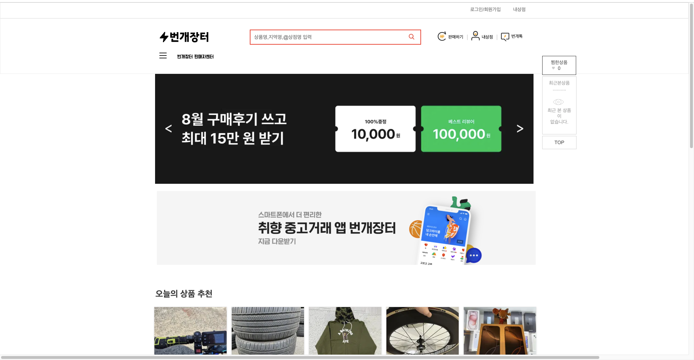

📌 PR 제목
[번개장터 클론코딩] 박성준 미션 제출합니다.

💡 설명
번개장터 판매자 센터 옆 전체 카테고리의 드롭다운을 구현하지 못했습니다. header,main,section,aside,footer등의 시멘틱 태그를 
사용하였고 map을 이용하여 중복코드를 제거 하였습니다. 

✅ 작업 목록

🔍 관련 이슈

💬 기타 참고사항

##클론 페이지를 만들면서 정확하게 칸과 디자인을 맞추는게 어려웠고 시간도 많이 걸렸던 것 같습니다.##
특히 ~~js~~부분에서 헷갈리는 부분이 있어 다시 이해해볼 예정입니다.
또한 제출기간을 지키려다보니 디자인을 많이 신경쓰지 못했던 것 같습니다.
다음번에는 **제출기간과 디자인 모두 완벽하게 할 수 있도록하겠습니다.** **죄송합니다.**